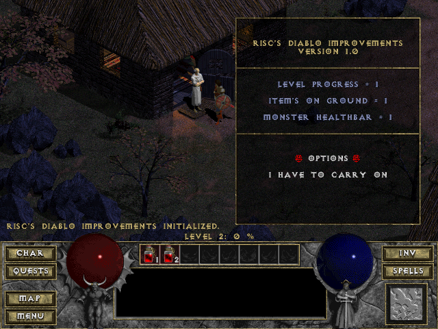
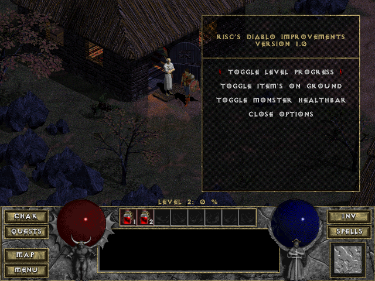
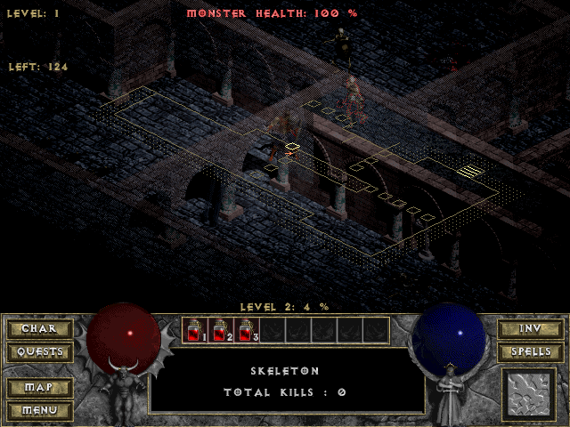
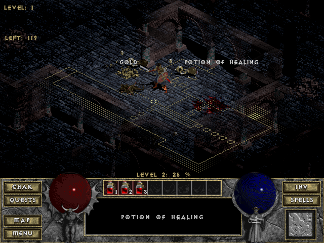

# Risc's Diablo Improvements
## Overview
This is a modification (mod) I wrote somewhere between 2008 and 2009 to Blizzard's Diablo 1 game. 
It's a DLL injection-based binary modification that extends the original game with some new features.

The modification does **NOT** circumvent any copy protection, so it will still require the original CD to play.
This is also not a trainer, it won't allow you to cheat in any way. It simply adds some features to the game to make it more convenient to play.

Featuring:
* Character level progress indicator
* Displays items on ground (like Diablo 2)
* Shows target health when hovering over monsters
* Displays total number of enemies left in the current level
* Customizable via built-in options menu

There are also some interesting things about the implementation:
* All text and menus are rendered with the games own routines
* The extension is unobtrusive and won't interfere with your save games
* It's pretty light on resources. The extension hooks Diablo's vsync-routine to minimize draw calls. 

## Screenshots

When starting the game, this screen greets you:

You can customize what to display through this menu:

Here we see that the player has reached 4% into level 2, 
there are 124 monsters left on the level and the skeleton we are hovering over has 100% health.
  

In this screenshot we see that two items currently in view are on the ground. 
A pile of gold and a potion of healing.

## The code
The implementation is based around the injection of a DLL into *Diablo.exe* which contain all new functionality.

Since the code is riddled with stuff like this...

	int* GetSelectedUnit()
	{
		//0x556814
		//monsterstruct_plats = 0x52688C + (monstertal * 0x0E4)
		int* unittal = (int*)0x556814;
		if(*unittal == -1)
			return 0;
		int* unit = (int*)(0x52688C + (*unittal * 0x0E4));	
		return unit;
	}

... the modification is only binary compatible with Diablo version 1.0 as delivered on the original CD.
Upgrading this project to work with 1.09 (the final Diablo patch) would require a major rewrite and most notably
a great deal of work to find and patch all misaligned function addresses. 

The detour functions were written by Dyndrilliac at the gamethreat.net forums. 
See http://www.gamethreat.net/forums/showthread.php?t=35461&page=2&p=635153&viewfull=1#post635153

Notice that in order to run this, you must run DLoader.exe from your Diablo folder. 
DLoader expects *diabloext.dll* to be in this folder.
